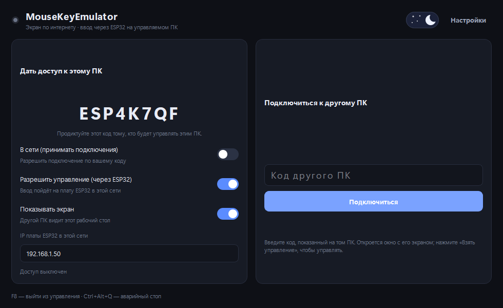
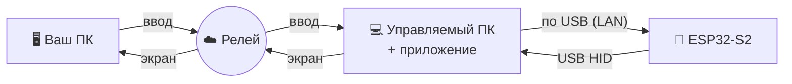

 

**Удалённый доступ, где экран идёт по интернету, а мышь и клавиатура — через плату ESP32 (настоящее USB-HID).**

Управляемый ПК показывает свой экран через сервер-релей, а ввод получает не программно, а с воткнутой в него **платы ESP32-S2**, которая для этого ПК выглядит как обычная USB-клавиатура и мышь.

 

[**⬇️ Скачать**](../../releases/latest) ·
[**🔌 Прошивка**](firmware/) ·
[**🌐 Софт-версия (без ESP32)**](https://github.com/DiFoxenGit/MouseKeyEmulator)

---

## 🎯 Что это

Вариант MouseKeyEmulator для случаев, когда ввод должен быть **аппаратным** и
неотличимым от настоящей мыши/клавиатуры:

- 🖥️ **Экран** управляемого ПК идёт вам по интернету (через релей).
- 🖱️⌨️ **Ввод** доставляется на управляемый ПК не программно, а через **плату
  ESP32-S2**, воткнутую в его USB — она вводит мышь/клавиатуру как настоящее
  USB-HID устройство.
- 🔗 Подключение по короткому **коду** (сквозь NAT, без проброса портов).

---

## ⚙️ Как это устроено

Ввод: ваш ПК → релей → приложение на управляемом ПК → по локальной сети на
плату ESP32 → плата вводит как настоящая USB-клавиатура/мышь.
Экран: управляемый ПК → релей → ваш ПК.

---

## 🚀 Быстрый старт

1. **Прошейте ESP32-S2** — файлы и инструкция в [`firmware/`](firmware/). Задайте
   плате Wi-Fi и общий ключ; узнайте её IP.
2. Воткните плату в USB **управляемого** ПК.
3. Запустите **`MouseKeyEmulator.exe`** (из [Releases](../../releases/latest)) на
   обоих ПК, активируйте лицензию.
4. **На управляемом ПК:** впишите **IP платы ESP32**, включите «В сети»,
   продиктуйте код.
5. **На вашем ПК:** введите код → «Подключиться» → «Взять управление».

> Общий ключ должен совпадать: в приложении (обоих ПК) и в прошивке платы.

---

## 🌐 Софт-версия (без ESP32)

Не нужен аппаратный ввод? Основной проект управляет мышью/клавиатурой программно
(`SendInput`), без платы: **[MouseKeyEmulator](https://github.com/DiFoxenGit/MouseKeyEmulator)**.

---

## 📜 Лицензии

Прошивка (`firmware/`) — [MIT](firmware/LICENSE). Приложение — [EULA](LICENSE).

 © 2026 MouseKeyEmulator · ESP32-версия

